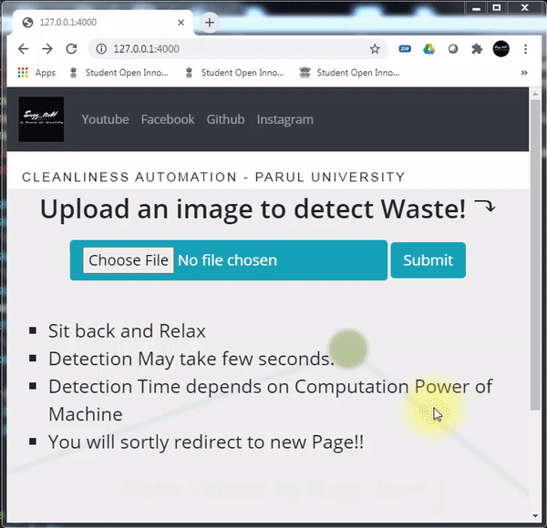
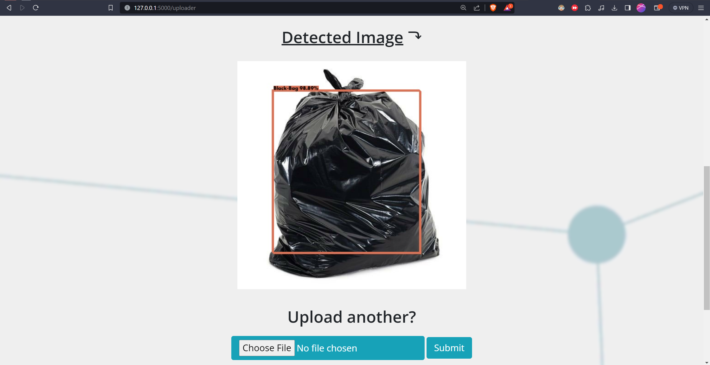

[](https://img.shields.io/badge/pipeline-passed-green
) 
[](https://img.shields.io/badge/coverage-86%25-orange
)

# Geo Waste detection system

Welcome to the Waste Detection App – an innovative solution for identifying and categorizing waste using Flask, Python 3.8, YOLO (You Only Look Once), and TensorFlow. This application empowers users to contribute to environmental sustainability by providing a streamlined and efficient way to distinguish different types of waste, such as plastic and food waste.

# Published Paper:
- [IEEE](https://ieeexplore.ieee.org/document/9418056)

## Features:
- Real-time Detection: Utilizing YOLO and TensorFlow, the app performs real-time waste detection, allowing users to capture or upload images for instant analysis.

- Waste Categorization: The application classifies detected waste into predefined categories, providing valuable insights into the composition of waste materials.

- User-Friendly Interface: With a clean and intuitive Flask-based web interface, users can easily interact with the application, making it accessible for a wide range of audiences.

- Environmental Impact: By identifying and categorizing waste, the app contributes to raising awareness about environmental issues and encourages responsible waste disposal practices.

## Requirements:
- Python 3.8
- Flask
- YOLO (You Only Look Once)
- TensorFlow

[Note]: Here, this repo doesnot contains weights file, hence you wont able to run the project, But, you can request us for the weight of educaction purpose.

## Getting Started:
1. Clone the Repository:
    
    ```bash
    git clone https://github.com/hmgtech/Geo-Waste.git
    cd geo-waste
    ```
2. Install Dependencies:

    ```python 
    pip install -r requirements.txt
    ```
    If you have multiple python version, do select 3.8 before creating environment

3. Run the Application:
    ```bash
    flask run
    ```
Visit http://localhost:5000 in your web browser to access the Geo Waste Detection App.

## Screenshots:
Demo:



Images:

1. 


2. 


3. 


## Developers

Meet the developers behind this project:

- **Hiteshkumar Gupta**
  - GitHub: [@hmgtech](https://github.com/hmgtech)
  - LinkedIn: [Hitesh Gupta](https://www.linkedin.com/in/hitesh-gupta-0878b3173/)


- **Tijilkumar Parmar**
  - LinkedIn: [Tijil Parmar](https://www.linkedin.com/in/tijil-parmar-009631161/)

- **Steeve Nazareth**
  - LinkedIn: [Steeve Nazareth](https://www.linkedin.com/in/steeve-nazareth/)

- **Prachi Gour**
  - LinkedIn: [Prachi Gour](https://www.linkedin.com/in/prachigour/)

## License:
This project is licensed under the terms of the [MIT license](LICENSE).

Feel free to explore and enhance the application to suit your needs. Happy waste detection! Read more.